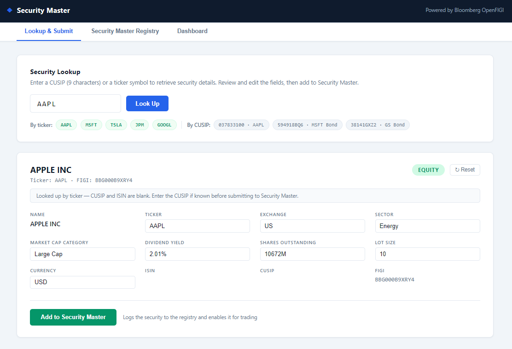
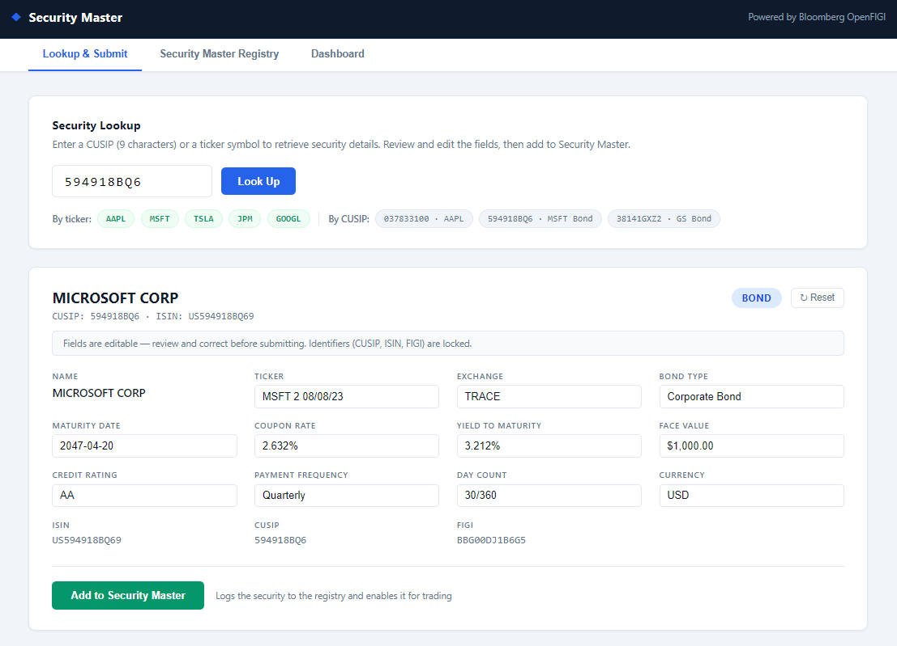
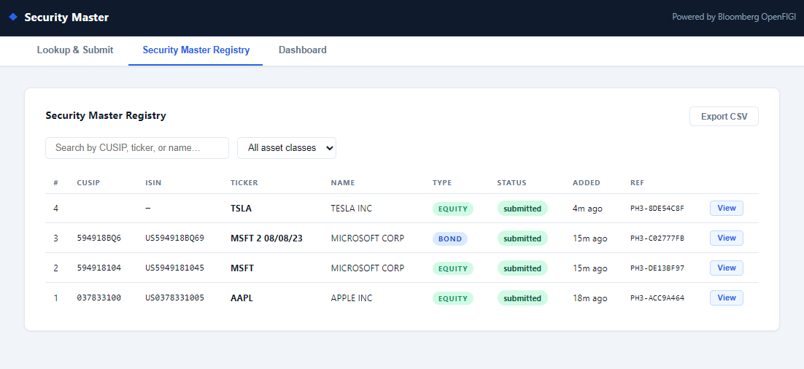
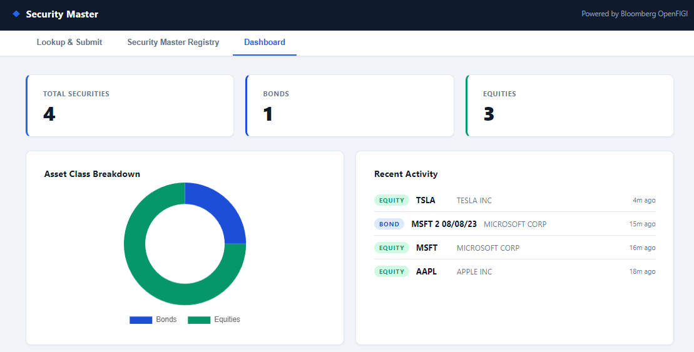

# Security Setup Automation

A full-stack web application that automates the securities onboarding workflow for bonds and equities. Enter a CUSIP or ticker symbol, retrieve enriched security data from Bloomberg's OpenFIGI API, review and edit the fields, then add to the Security Master in one click — replacing a previously manual, multi-step process.


---

## Screenshots

### Equity Lookup

*Look up any equity by CUSIP or ticker — sector, market cap, dividend yield, ISIN and more returned instantly from Bloomberg OpenFIGI*

### Bond Lookup

*Bond CUSIPs surface maturity date, coupon rate, yield-to-maturity, credit rating, day count convention, and payment frequency*

### Security Master Registry

*Searchable, filterable audit log of every security added — export to CSV for reconciliation*

### Dashboard

*Live stats and bond/equity breakdown chart across all securities in the registry*

---

## The Problem

In fixed income and equity operations, adding a new security for trading requires:

1. Looking up the CUSIP across multiple systems to pull maturity, coupon, ISIN, ticker, and ratings data
2. Manually entering that data into a vendor portal (e.g. a prime broker or custodian platform)
3. Waiting for confirmation before the security can be traded

This process is error-prone and slow when done by hand — especially at scale across bond and equity desks.

## The Solution

This tool condenses that entire workflow into three steps:

- **CUSIP or Ticker → Full Security Profile** via Bloomberg's OpenFIGI API
- **Review and edit** any field before submission — corrections stay, identifiers (CUSIP, ISIN, FIGI) are locked
- **One-click submission** to the Security Master with a generated reference number and full audit trail

---

## Features

- **Dual lookup** — search by CUSIP (9 characters) or ticker symbol (AAPL, MSFT, JPM, etc.)
- **Real Bloomberg data** via [OpenFIGI](https://www.openfigi.com/) (free, no key required for basic use)
- **Asset-class-aware enrichment** — bonds surface maturity, coupon, yield, credit rating, day count; equities surface sector, market cap tier, dividend yield, shares outstanding
- **ISIN computation** from CUSIP using the standard Luhn check-digit algorithm
- **Editable fields** — review and correct enriched data before it enters the registry
- **Security Master Registry** — searchable/filterable table with modal detail view and CSV export
- **Dashboard** — live stat cards and a bond/equity breakdown chart (Chart.js)
- **Persistent audit log** — SQLite stores a full JSON snapshot of each security at submission time

---

## Demo

### Try these out of the box

| Input | Security | Type |
|-------|----------|------|
| `AAPL` | Apple Inc | Equity (ticker) |
| `MSFT` | Microsoft Corp | Equity (ticker) |
| `TSLA` | Tesla Inc | Equity (ticker) |
| `JPM` | JPMorgan Chase | Equity (ticker) |
| `037833100` | Apple Inc | Equity (CUSIP) |
| `594918BQ6` | Microsoft Corp Bond | Bond (CUSIP) |
| `38141GXZ2` | Goldman Sachs Bond | Bond (CUSIP) |

> Ticker lookups return all available fields — CUSIP and ISIN are left blank and editable so you can fill them in if known.

---

## Tech Stack

| Layer       | Technology                       |
|-------------|----------------------------------|
| Backend     | Python 3.9+, Flask 3.0           |
| Database    | SQLite (zero-config, file-based) |
| Market Data | Bloomberg OpenFIGI REST API      |
| Frontend    | Vanilla JS, HTML5, CSS3          |
| Charts      | Chart.js                         |
| ISIN Calc   | Luhn algorithm (standard)        |

---

## Setup

**1. Clone the repo**
```bash
git clone https://github.com/your-username/security-setup-automation.git
cd security-setup-automation
```

**2. Install dependencies**
```bash
pip install -r requirements.txt
```

**3. (Optional) Set an OpenFIGI API key for higher rate limits**

Without a key you get 10 requests/minute — plenty for local use.
Register free at [openfigi.com](https://www.openfigi.com/api).

```bash
export OPENFIGI_API_KEY=your_key_here   # Windows: set OPENFIGI_API_KEY=your_key_here
```

**4. Run the app**
```bash
python app.py
```

Open [http://localhost:5000](http://localhost:5000) in your browser. The SQLite database is created automatically on first launch.

---

## Project Structure

```
security-setup-automation/
├── app.py                     # Flask routes
├── config.py                  # Config (API URL, DB path, vendor name)
├── requirements.txt
├── schema.sql                 # DB schema reference
├── services/
│   ├── cusip_lookup.py        # Bloomberg OpenFIGI — CUSIP and ticker lookup
│   ├── enrichment.py          # Bond/equity enrichment + ISIN calculation
│   └── vendor.py              # Security Master submission handler
├── db/
│   └── database.py            # SQLite — init, save, query, stats
├── templates/
│   └── index.html
├── static/
│   ├── css/style.css
│   └── js/app.js
└── images/                    # Screenshots for this README
```

---

## API Endpoints

| Method | Endpoint           | Description                                      |
|--------|--------------------|--------------------------------------------------|
| POST   | `/api/lookup`      | Fetch security details by CUSIP or ticker        |
| POST   | `/api/submit`      | Add security to Security Master, log to DB       |
| GET    | `/api/submissions` | Return full submission history as JSON           |
| GET    | `/api/stats`       | Return counts and recent activity for dashboard  |
| GET    | `/api/export`      | Download submission history as CSV               |

**Lookup by CUSIP:**
```json
POST /api/lookup
{ "cusip": "037833100" }
```

**Lookup by ticker:**
```json
POST /api/lookup
{ "cusip": "AAPL" }
```

**Response (equity):**
```json
{
  "cusip": "037833100",
  "isin": "US0378331005",
  "ticker": "AAPL",
  "name": "APPLE INC",
  "asset_class": "EQUITY",
  "exchange": "UW",
  "sector": "Technology",
  "market_cap_category": "Large Cap",
  "dividend_yield": "0.52%",
  "currency": "USD"
}
```

---

## How It Works

1. **Lookup** — POST to `/api/lookup` with a CUSIP or ticker; auto-detected by length
2. **OpenFIGI** returns FIGI, ticker, name, exchange, and market sector
3. **Enrichment** detects asset class from OpenFIGI's `marketSector`/`securityType` and appends the relevant field set (bond or equity)
4. **ISIN** is computed from CUSIP using the standard algorithm: `US` + CUSIP + Luhn check digit
5. **Edit** — all fields except identifiers are editable before submission
6. **Submit** → POST to `/api/submit` → reference ID generated, full snapshot saved to SQLite
7. **Registry and Dashboard** update live after each submission

---

## License

MIT
